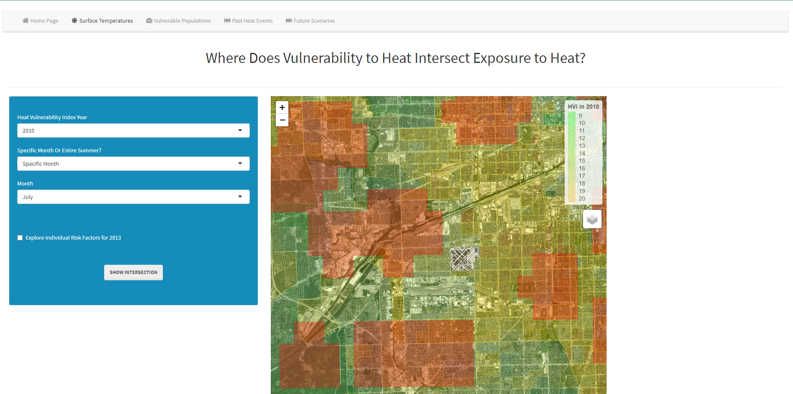

# Chicago Heat Vulnerability Mapper

Datasets and code for Chicago Heat Vulnerability Mapper project

Web application has been [revived here](https://bw6xs.shinyapps.io/chicagoheat):  

This project was funded by the [Lincoln Institute of Land Policy](https://www.lincolninst.edu/about-lincoln-institute) and led to the development of an open-source, web-based tool that could be used to visualize scenarios that capture possible distributions of heat-exposure and vulnerability over space. The  Chicago Heat Vulnerability Mapper tool is designed as a multi-tab website that separates the primary visualization functionality by exposure metric, analysis method, and time horizon. 

The **Surface Temperatures** tab allows users to visualize the distribution of the Heat Vulnerability Index alongside estimates of maximum temperatures for June, July, August, as well as the entire summer. The **Vulnerable Populations** tab allows users to map statistically significant clusters of high and low values of the Heat Vulnerability Index in 1990, 2000, and 2010 in addition to the individual risk factors described above. The **Past Heat Events** tab presents an interpolated estimate of the National Weather Service heat index at the time of historical heat events for which fatalities were recorded in the Chicago region. And finally, the **Future Scenarios** tab allows users to visualize climate model predictions of maximum daily temperatures for the region in the year 2030 under different greenhouse gas concentration trajectories alongside extrapolated values of the Heat Vulnerability Index consistent with the trend observed over the past two decades. 

Vulnerability to extreme heat events has been conceptualized as a function of: (1) exposure, (2) sensitivity, and (3) adaptive capacity[^1]. Under this framework an elderly person with heart disease has high sensitivity, but if that individual is not exposed to high levels of heat or if that individual has the adaptive capacity to mitigate the negative effects of high heat (i.e., access to and ability to pay for air conditioning), they are  less vulnerable than those with the same sensitivity but also low capacity and/or high exposure. One of the goals of this research project was to measure the sensitivity and adaptive capacity components of vulnerability to extreme heat and in the Chicago Heat Vulnerability Mapper, we separate out the exposure component and represent it using estimates of land surface temperature and the National Weather Service heat index. The ultimate objective is visualize the intersection of vulnerability to extreme heat—understood as sensitivity plus adaptive capacity—with exposure to extreme heat over time.

[^1]: Wilhelmi, O. V., & Hayden, M. H. (2010). Connecting people and place: A new framework for 
reducing urban vulnerability to extreme heat. _Environmental Research Letters_, 5(1), 14-21.
